# Architecture Overview

Clean, scalable architecture for engineering metrics tracking with API-first design and service layer separation.

## 1. Project Structure

Production-ready Next.js structure with service layer pattern:

```
leaders-metrics/
├── .github/                # GitHub configuration
├── app/                    # Next.js App Router
│   ├── api/               # API endpoints (HTTP concerns only)
│   │   ├── teams/[id]/    # RESTful team resources
│   │   ├── goals/[id]/    # RESTful goal resources  
│   │   ├── metrics/       # Metric submission endpoints
│   │   ├── dashboard/     # Dashboard data aggregation
│   │   └── openapi/       # API documentation endpoint
│   ├── dashboard/         # Dashboard pages
│   ├── teams/[id]/        # Team detail and management
│   ├── goals/[id]/        # Goal detail and management
│   ├── metrics/           # Metric management pages
│   ├── about/             # About page
│   ├── auth/              # Authentication pages
│   ├── api-docs/          # API documentation UI
│   ├── chart-exports-client/ # Chart export functionality
│   └── views-proto/       # Prototype views (dev only)
├── components/            # React components
│   ├── ui/               # shadcn/ui components
│   ├── forms/            # Form components with validation
│   ├── layout/           # Navigation and layout
│   ├── dashboard/        # Dashboard-specific components
│   ├── teams/            # Team-specific components
│   ├── goals/            # Goal-specific components
│   ├── auth/             # Authentication components
│   ├── feedback/         # Feedback form components
│   └── onboarding/       # User onboarding components
├── lib/                  # Business logic and utilities
│   ├── *-service.ts      # Business logic services
│   ├── server-api.ts     # Server-side API client (SSR)
│   ├── browser-api.ts    # Browser-side API client (CSR)
│   ├── card-export-utils.ts # PNG export utilities
│   ├── schemas.ts        # Zod validation schemas
│   ├── db.ts            # Prisma client
│   ├── env.ts           # Environment validation
│   ├── auth-server.ts   # Server-side auth utilities
│   ├── auth-utils.ts    # Authentication utilities
│   ├── api-auth.ts      # API authentication
│   └── metadata.ts      # SEO metadata utilities
├── hooks/                # Custom React hooks
│   └── use-navigation.ts # Navigation utilities
├── types/                # TypeScript type definitions
│   ├── auth.ts          # Authentication types
│   └── display.ts       # UI display types
├── docs/                 # Project documentation
│   ├── implementation-log/ # Development logs
│   └── *.md             # Feature documentation
├── scripts/              # Build and maintenance scripts
│   ├── generate-openapi.ts # OpenAPI generation
│   ├── seed-demo-data.ts   # Demo data seeding
│   └── migrations/         # Data migration scripts
├── tasks/                # Development task tracking
├── prisma/              # Database layer
│   ├── schema.prisma    # Database schema
│   ├── migrations/      # Database migrations
│   ├── seed.ts         # Database seeding
│   └── demo-seed.ts    # Demo data seeding
└── public/              # Static assets
    ├── favicon.svg      # Site favicon
    └── *.svg           # Brand assets
```

## 2. Service Layer Architecture

**Business Logic Separation**: All business logic extracted from API routes into dedicated service modules:

- **`goal-service.ts`**: Goal operations, progress calculations, cascading deletions
- **`team-service.ts`**: Team operations, deletion impact analysis  
- **`metric-service.ts`**: Metric creation, filtering, trend analysis
- **`feedback-service.ts`**: Feedback collection and management operations
- **`auth-utils.ts`**: Authentication utilities, provider transformations
- **`card-export-utils.ts`**: PNG export utilities for goal cards and charts
- **API Routes**: HTTP concerns only (request/response handling, status codes)

## 3. API-First Design

### Centralized Data Access
- **Server Components**: Use `lib/server-api.ts` for SSR data fetching
- **Client Components**: Use `lib/browser-api.ts` for CSR operations
- **Direct Database Access**: Prohibited in components, only through APIs
- **Consistent Responses**: Standardized `{ data, success, error? }` format

### RESTful API Design
- **Resource-based URLs**: `/api/teams/{id}/goals`, `/api/goals/{id}/metrics`
- **HTTP Methods**: GET, POST, PUT, DELETE following REST conventions
- **Status Codes**: Proper HTTP status codes for all scenarios
- **OpenAPI Documentation**: Complete interactive documentation at `/api-docs`

### Validation Strategy
- **Request Validation**: Zod schemas for all API inputs
- **Response Validation**: Type-safe responses with Zod schema generation
- **Error Consistency**: Standardized error formats across all endpoints

## 4. Tech Stack

### Core Framework
- **Next.js 15** - App Router with TypeScript
- **PostgreSQL** - Primary database on Neon
- **Prisma ORM** - Database operations with Neon adapter
- **Auth.js** - Authentication and authorization

### UI & Styling  
- **shadcn/ui** - Component library
- **Tailwind CSS** - Utility-first styling
- **Recharts** - Data visualization

### Development & Quality
- **TypeScript** - Strict type safety
- **Zod** - Runtime validation and schema generation
- **Jest** - Unit and integration testing
- **ESLint** - Code quality enforcement

## 5. Design Principles

### 1. Service Layer Pattern
```typescript
// ❌ Business logic in API route
export async function POST(request: Request) {
  // Complex calculations and validations here
}

// ✅ Business logic in service layer  
export async function POST(request: Request) {
  const result = await goalService.createGoal(data)
  return NextResponse.json(result)
}
```

### 2. Type Safety First
- **No `any` types**: Explicit TypeScript interfaces for all data structures
- **Runtime Validation**: Zod schemas validate API boundaries
- **Schema-Driven Development**: OpenAPI generation from Zod schemas

### 3. Testing Architecture
- **Unit Tests**: Service layer business logic (`lib/*-service.ts`)
- **Integration Tests**: API route handlers with mocked Prisma
- **Component Tests**: User interaction and accessibility
- **Quality Gates**: CI/CD pipeline ensures all tests pass

### 4. Separation of Concerns
- **API Routes**: HTTP protocol handling only
- **Services**: Business logic, validations, calculations
- **Components**: UI presentation and user interaction
- **Database**: Data persistence through Prisma

### 5. Environment Detection Standards
- **Centralized Functions**: Use consistent environment detection across all components
- **Conservative Security**: Environment checks for security features must be fail-safe
- **Single Source of Truth**: All environment logic in dedicated utility functions

```typescript
// ✅ Correct: Centralized environment detection
import { isTestEnvironment } from "@/lib/test-users"

if (isTestEnvironment()) {
  // Show development features
}

// ❌ Incorrect: Direct environment checks scattered across files
if (process.env.NODE_ENV === "development") {
  // Inconsistent with other environment logic
}
```

**Authentication Security**:
- **Production**: Only Google and GitHub OAuth providers available
- **Demo account**: Uses credentials provider with predefined account

### 6. Navigation Standards
- **Client-Side Navigation**: Always use Next.js router for programmatic navigation
- **No Browser Navigation**: Never use `window.location.href` for internal routes

```typescript
// ✅ Correct: Next.js router
import { useRouter } from 'next/navigation'

const router = useRouter()
router.push('/dashboard')         // Client-side navigation
router.refresh()                  // Refresh server components

// ❌ Incorrect: Browser navigation  
window.location.href = '/dashboard' // Causes full page reload
```

**Navigation Patterns**:
- **Post-Authentication**: Use `router.push()` with callback URL support
- **Error Handling**: Handle navigation errors gracefully
- **Loading States**: Provide feedback during navigation transitions

### 7. Code Organization Rules
1. **API Routes**: HTTP concerns only (validation, response formatting)
2. **Service Layer**: All business logic, calculations, database operations
3. **Components**: UI presentation, user interaction handling
4. **Shared Utilities**: Common functions in `lib/utils.ts`
5. **Environment Detection**: Use centralized functions, not direct `process.env` checks

## 6. Data Flow Architecture

### Server-Side Rendering (SSR)
```
Page Component → lib/server-api.ts → API Route → Service Layer → Database
```

### Client-Side Interactions (CSR)
```
User Action → Component → lib/browser-api.ts → API Route → Service Layer → Database
```

## 7. Quality Gates

### Mandatory Checks
Before any feature completion:

- [ ] **Service Layer**: Business logic extracted from API routes
- [ ] **Unit Tests**: Complete test coverage for service business logic
- [ ] **Type Safety**: No `any` types, proper interfaces
- [ ] **API Documentation**: OpenAPI schemas updated
- [ ] **Integration Tests**: API routes tested with mocked dependencies

## 8. Scalability Considerations

### Current Architecture Supports
- **Microservices Migration**: Clean service boundaries
- **Horizontal Scaling**: Stateless API design
- **Database Scaling**: Prisma connection pooling ready
- **Testing Automation**: Comprehensive test coverage established

## 9. Architecture Diagrams

### System Context Diagram (Level 1)

```mermaid
graph TB
    %% Users
    EL[👤 Engineering Leader<br/>Team lead tracking metrics and goals]
    TM[👤 Team Member<br/>Submits metrics via API or manual form]
    DU[👤 Demo User<br/>Explores app with sample data]
    
    %% Main System
    subgraph LM["🏢 Leaders Metrics Platform"]
        APP[📊 Leaders Metrics<br/>Engineering metrics tracking application<br/>with dashboard, goal management,<br/>and team insights]
    end
    
    %% External Systems
    GOOGLE[🔐 Google OAuth<br/>OAuth authentication provider]
    GITHUB[🔐 GitHub OAuth<br/>OAuth authentication provider]
    NEON[🗄️ Neon PostgreSQL<br/>Cloud-hosted PostgreSQL database]
    VERCEL[☁️ Vercel Platform<br/>Hosting and deployment platform]
    
    %% Relationships
    EL -->|Manages teams, sets goals,<br/>views dashboard| APP
    TM -->|Submits metrics,<br/>updates progress| APP
    DU -->|Explores with<br/>sample data| APP
    
    APP -->|Authenticates users<br/>OAuth 2.0| GOOGLE
    APP -->|Authenticates users<br/>OAuth 2.0| GITHUB
    APP -->|Stores and retrieves data<br/>Prisma/PostgreSQL| NEON
    APP -->|Deployed on<br/>HTTPS| VERCEL
    
    classDef userClass fill:#e1f5fe,stroke:#01579b,stroke-width:2px
    classDef systemClass fill:#f3e5f5,stroke:#4a148c,stroke-width:2px
    classDef externalClass fill:#e8f5e8,stroke:#1b5e20,stroke-width:2px
    
    class EL,TM,DU userClass
    class APP systemClass
    class GOOGLE,GITHUB,NEON,VERCEL externalClass
```



### Container Diagram (Level 2)

```mermaid
graph TB
    %% Users
    USER[👤 User<br/>Engineering leaders and team members]
    
    %% External Systems
    OAUTH[🔐 OAuth Providers<br/>Google & GitHub authentication]
    DB[🗄️ Neon PostgreSQL<br/>Cloud database]
    
    %% Main System Boundary
    subgraph LM["🏢 Leaders Metrics Platform"]
        WEB[🌐 Next.js Web Application<br/>Next.js 15, TypeScript, React<br/>Dashboard, forms, and user interface<br/>for metrics tracking]
        
        API[🔌 API Layer<br/>Next.js API Routes<br/>RESTful API endpoints for teams,<br/>goals, metrics, and authentication]
        
        SERVICE[⚙️ Service Layer<br/>TypeScript Services<br/>Business logic for team, goal,<br/>and metric operations]
        
        AUTH[🛡️ Authentication Middleware<br/>Auth.js v5<br/>OAuth authentication and<br/>route protection]
        
        DATA[💾 Database Layer<br/>Prisma ORM<br/>Type-safe database operations]
    end
    
    %% Relationships
    USER -->|Views dashboard,<br/>manages teams/goals<br/>HTTPS| WEB
    USER -->|Submits metrics,<br/>API calls<br/>HTTPS/JSON| API
    
    WEB -->|Fetches data, submits forms<br/>server-api.ts / browser-api.ts| API
    WEB -->|Authentication checks<br/>middleware.ts| AUTH
    API -->|Business logic calls<br/>TypeScript| SERVICE
    SERVICE -->|Data operations<br/>Prisma Client| DATA
    AUTH -->|OAuth flow<br/>OAuth 2.0| OAUTH
    DATA -->|Database operations<br/>PostgreSQL| DB
    
    %% Architecture annotation
    API -.->|Clean separation:<br/>API routes handle HTTP only,<br/>Services contain business logic| SERVICE
    
    classDef userClass fill:#e1f5fe,stroke:#01579b,stroke-width:2px
    classDef containerClass fill:#fff3e0,stroke:#e65100,stroke-width:2px
    classDef externalClass fill:#e8f5e8,stroke:#1b5e20,stroke-width:2px
    
    class USER userClass
    class WEB,API,SERVICE,AUTH,DATA containerClass
    class OAUTH,DB externalClass
```



### System Architecture Overview


These diagrams provide visual representation of the architecture described above, showing the system context, container relationships, and overall system layer organization.