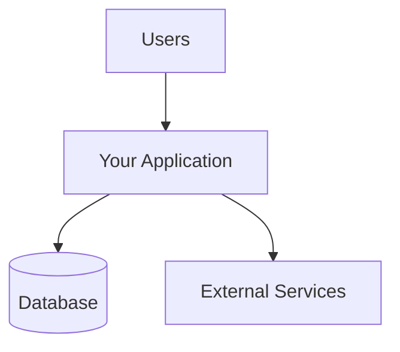
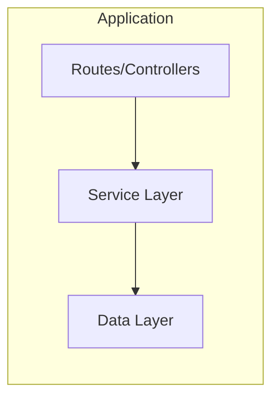

# Architecture Overview – [YOUR_PROJECT_NAME]

Clean, scalable architecture with clear separation of concerns and service layer pattern.

---

## 1. Project Structure

Document your actual project structure here:

```
[your-project]/
├── [source-directory]/        # Main application code
│   ├── [api-or-routes]/       # API endpoints / route handlers
│   ├── [services]/            # Business logic services
│   ├── [models-or-entities]/  # Data models / database entities
│   ├── [components-or-views]/ # UI components (if applicable)
│   ├── [utils-or-lib]/        # Shared utilities and helpers
│   └── [config]/              # Application configuration
├── [test-directory]/          # Tests
│   ├── unit/                  # Unit tests
│   ├── integration/           # Integration tests
│   └── utils/                 # Test utilities and fixtures
├── agents/                    # AI Agent instructions
├── tasks/                     # Task definitions
├── [database-config]/         # Database schemas/migrations
├── [public-or-static]/        # Static assets (if applicable)
└── [build-or-dist]/           # Build output (gitignored)
```

**Customization Note**: Replace bracketed placeholders with your actual folder names. For example:
- Next.js: `app/`, `lib/`, `components/`, `prisma/`
- Django: `apps/`, `services/`, `templates/`, `migrations/`
- Rails: `app/`, `lib/`, `config/`, `db/`
- Go: `cmd/`, `internal/`, `pkg/`, `tests/`

---

## 2. Service Layer Architecture

**Universal Principle: Separation of Business Logic**

All business logic must be extracted from API routes/controllers into dedicated service modules:

### Service Layer Responsibilities
- **Business Logic**: All calculations, validations, and domain rules
- **Data Operations**: CRUD operations through ORM/database client
- **Transaction Management**: Multi-step operations with rollback capability
- **Error Handling**: Domain-specific error translation

### API/Controller Layer Responsibilities
- **HTTP Concerns Only**: Request parsing, response formatting, status codes
- **Input Validation**: Basic format/type validation (delegate business rules to services)
- **Authentication/Authorization**: Identity and permission checks
- **Serialization**: Converting between HTTP and domain models

### Example (TypeScript/Node.js)
```typescript
// ❌ Business logic in API route
export async function POST(request: Request) {
  const data = await request.json()
  // Complex calculations and validations here
  const result = await database.create(data)
  return NextResponse.json(result)
}

// ✅ Business logic in service layer  
export async function POST(request: Request) {
  const data = await request.json()
  const result = await goalService.createGoal(data)
  return NextResponse.json(result)
}
```

### Example (Python/Django)
```python
# ❌ Business logic in view
def create_goal(request):
    data = json.loads(request.body)
    # Complex calculations and validations here
    goal = Goal.objects.create(**data)
    return JsonResponse({"data": goal})

# ✅ Business logic in service layer
def create_goal(request):
    data = json.loads(request.body)
    result = goal_service.create_goal(data)
    return JsonResponse(result)
```

### Suggested Service Names
- `[domain]-service.[ext]` - e.g., `user-service.ts`, `order-service.py`, `payment-service.go`
- Group related operations in same service
- Keep services focused (Single Responsibility Principle)

---

## 3. Tech Stack

### Core Framework
- **[Framework Name]** - [Version] - [Purpose/Role]
- **[Language]** - [Version] - [Purpose/Role]
- **[Database]** - [Type/Version] - [Purpose/Role]
- **[ORM/Query Tool]** - [Name/Version] - [Purpose/Role]

### Development & Quality
- **[Type System]** - e.g., TypeScript, Python typing, Go types
- **[Validation Library]** - e.g., Zod, Pydantic, validator
- **[Testing Framework]** - e.g., Jest, Pytest, Go test, RSpec
- **[Linter]** - e.g., ESLint, Pylint, golangci-lint, RuboCop

### Additional Tools
- **[Tool 1]** - [Purpose]
- **[Tool 2]** - [Purpose]
- **[Tool 3]** - [Purpose]

---

## 4. Design Principles

### 1. Service Layer Pattern (Universal)
**All business logic lives in services, not in routes/controllers/views**

Benefits:
- Easy to test (no HTTP mocking needed)
- Reusable across different interfaces (HTTP, CLI, jobs)
- Clear separation of concerns
- Simplified route handlers

### 2. Type Safety First (Universal)
**Strong typing at boundaries and throughout the codebase**

- No `any` types in TypeScript
- Use type hints in Python
- Explicit interfaces in Go
- Strong parameter types in Ruby
- Runtime validation at API boundaries
- Schema-driven development where possible

### 3. Testing Architecture (Universal)
**Test pyramid: Many unit tests, some integration tests, few E2E tests**

- **Unit Tests**: Service layer business logic, pure functions, validators
- **Integration Tests**: API route handlers, database operations, external services
- **Component Tests**: User-visible behavior and accessibility (if UI)
- **Quality Gates**: CI/CD pipeline ensures all tests pass

### 4. Separation of Concerns (Universal)
**Each layer has a single, well-defined responsibility**

- **API/Routes**: HTTP protocol handling only
- **Services**: Business logic, validations, calculations
- **Models/Entities**: Data structure and persistence
- **Components/Views**: UI presentation and user interaction (if applicable)
- **Utils**: Shared helper functions with no side effects

### 5. Dependency Direction (Universal)
**Dependencies flow inward: Routes → Services → Data Layer**

```
┌─────────────┐
│  Routes/API │ ← HTTP concerns only
└──────┬──────┘
       │
       ▼
┌─────────────┐
│  Services   │ ← Business logic
└──────┬──────┘
       │
       ▼
┌─────────────┐
│  Data Layer │ ← Database operations
└─────────────┘
```

Never:
- Services calling routes
- Data layer implementing business rules
- Routes containing calculations

### 6. Explicit Over Implicit (Universal)
**Code should be clear and obvious**

- Favor readability over cleverness
- Make dependencies explicit
- Use descriptive names
- Avoid magic numbers or strings
- Document non-obvious decisions

---

## 5. Data Flow Architecture

### [Primary Flow Name] (e.g., Server-Side Rendering, API Request, etc.)
```
[Entry Point] → [Service Layer] → [Data Layer] → [Response]
```

Example:
```
HTTP Request → Route Handler → Service → Database → Service → Route → HTTP Response
```

### [Secondary Flow Name] (e.g., Background Jobs, CLI Commands, etc.)
```
[Trigger] → [Service Layer] → [Data Layer] → [Result]
```

---

## 6. Quality Gates

### Mandatory Checks Before Feature Completion

**Universal standards that apply to all implementations:**

- [ ] **Service Layer**: Business logic extracted from API routes/controllers
- [ ] **Unit Tests**: Complete test coverage for service business logic
- [ ] **Type Safety**: Strong typing throughout (no `any`, proper type hints)
- [ ] **Integration Tests**: API routes/endpoints tested with appropriate mocking
- [ ] **Code Quality**: No duplication, clear naming, proper error handling
- [ ] **Documentation**: API documentation updated (if changed)

---

## 7. Coding Standards

### Naming Conventions
- **Files**: [your-convention - e.g., kebab-case, snake_case, PascalCase]
- **Functions**: [your-convention - e.g., camelCase, snake_case]
- **Classes**: [your-convention - e.g., PascalCase]
- **Constants**: [your-convention - e.g., UPPER_SNAKE_CASE]
- **Variables**: [your-convention - e.g., camelCase, snake_case]

### File Organization Rules (Universal Principles)
1. **API Routes/Controllers**: HTTP concerns only (validation, response formatting)
2. **Service Layer**: All business logic, calculations, database operations
3. **Components/Views**: UI presentation, user interaction handling
4. **Shared Utilities**: Common functions with no side effects
5. **Configuration**: Environment-specific settings in dedicated files

### Error Handling (Universal)
- Use domain-specific exceptions/errors
- Handle errors at appropriate layer
- Provide meaningful error messages
- Log errors with context
- Return consistent error responses

### Code Style
- [Your linter configuration]
- [Your formatter settings]
- [Line length limits]
- [Import organization rules]

---

## 8. Security Standards (Universal Principles)

### Authentication & Authorization
- [Your auth strategy - e.g., JWT, Sessions, OAuth]
- [Authorization approach - e.g., RBAC, ABAC]
- [Session management]

### Input Validation
- Validate all user input
- Use whitelisting over blacklisting
- Sanitize before processing
- Type-safe validation at boundaries

### Data Protection
- [Encryption at rest]
- [Encryption in transit]
- [Sensitive data handling]
- [PII protection]

### API Security
- [Rate limiting]
- [CORS policy]
- [API key management]
- [Request signing]

---

## 9. Scalability Considerations (Universal Principles)

### Current Architecture Supports
- **Service Boundaries**: Clean separation enables microservices migration
- **Stateless Design**: Horizontal scaling ready
- **Database Patterns**: Connection pooling, query optimization
- **Caching Strategy**: [Your approach - Redis, in-memory, CDN]
- **Testing Automation**: Comprehensive test coverage enables confident refactoring

### Performance Patterns
- [Database query optimization approach]
- [Caching strategy]
- [Background job processing]
- [Asset optimization]

---

## 10. Architecture Diagrams (Optional but Recommended)

Use Mermaid, ASCII art, or links to external diagrams to visualize:

### System Context


### Component Architecture


---

## Customization Instructions

To adapt this architecture document for your project:

1. **Replace all `[placeholders]`** with your actual:
   - Directory names
   - Technology names
   - Framework-specific patterns
   - Command examples

2. **Keep all universal principles**:
   - Service layer pattern
   - Separation of concerns
   - Testing architecture
   - Type safety
   - Dependency direction
   - Quality gates

3. **Add framework-specific sections** as needed:
   - Middleware patterns
   - ORM usage guidelines
   - State management (for frontend)
   - Job queue handling
   - WebSocket patterns

4. **Include diagrams** that help visualize your architecture

The universal principles (service layer, separation of concerns, testing, type safety) apply to any well-architected application and should be preserved.
